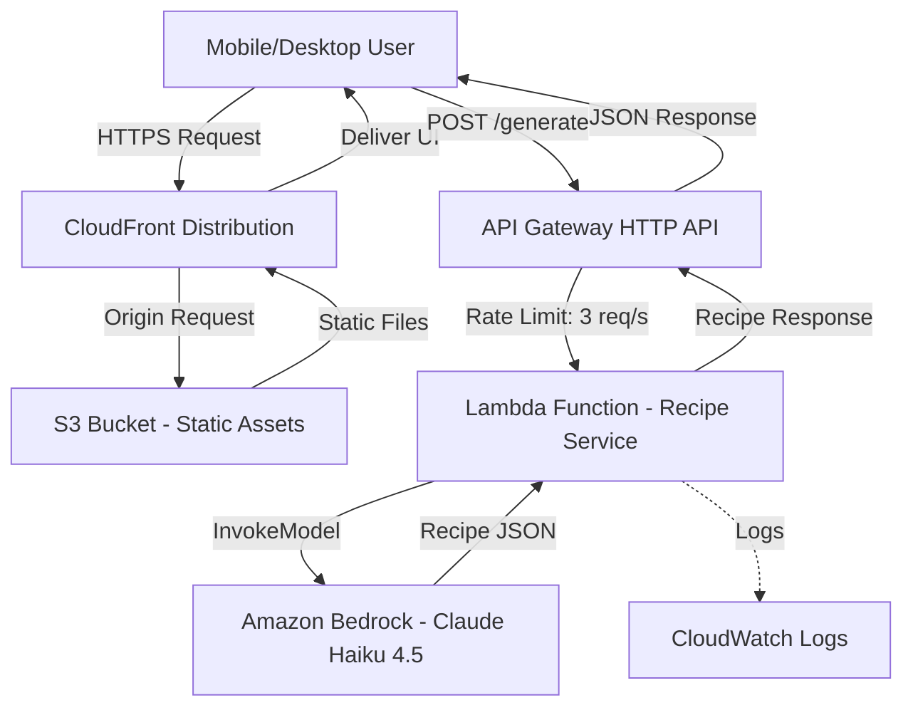
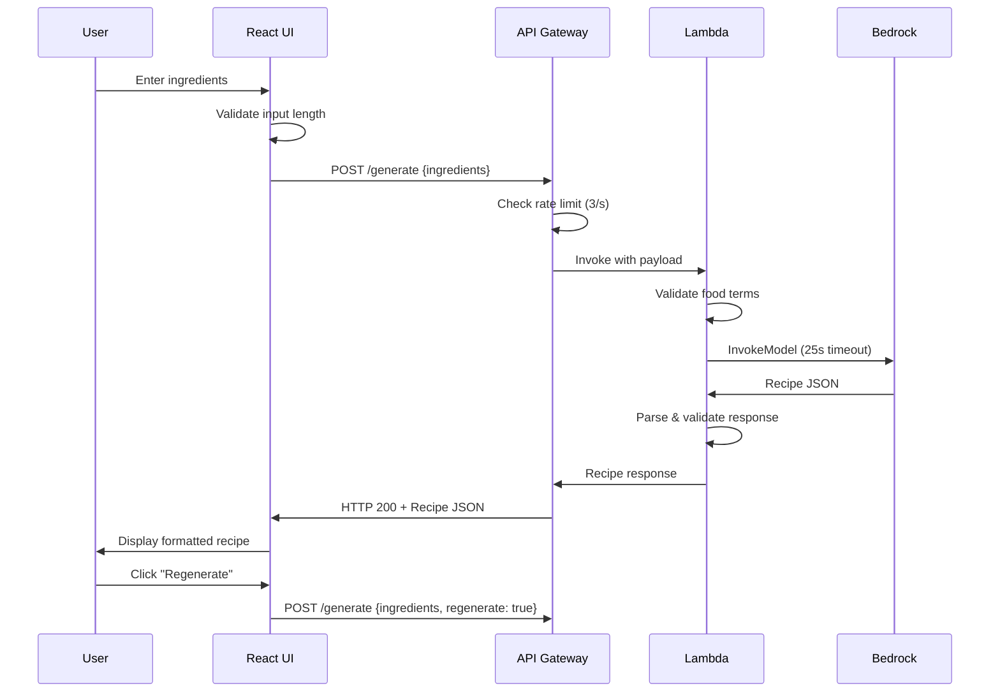
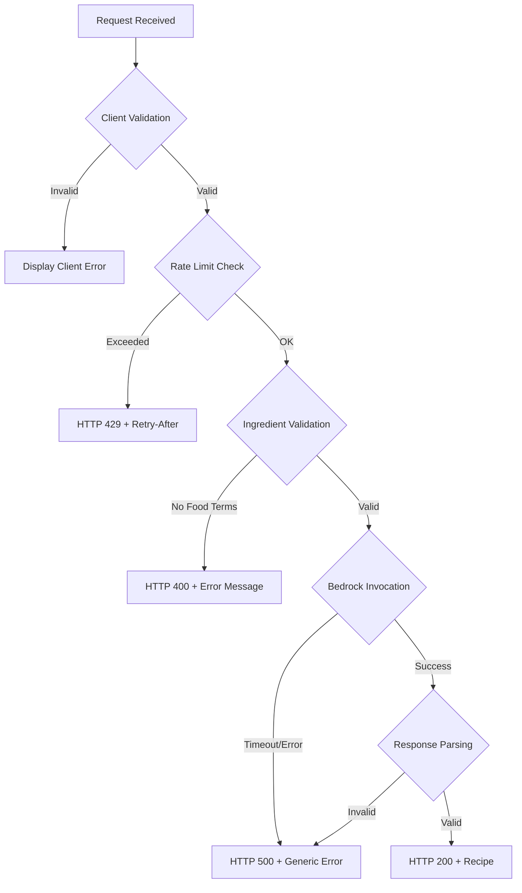

# Design Document: Recipe AI Generator

## Overview

Recipe AI Generator is a serverless web application that transforms user-provided ingredient lists into complete, actionable recipes using Amazon Bedrock's Claude Haiku 4.5 model. The system follows a mobile-first design philosophy, prioritizing simplicity, cost-efficiency, and stateless operation.

### Key Design Principles

1. **Stateless Architecture**: No database or persistent storage for user data
2. **Mobile-First**: Optimized for 375-430px viewports with responsive scaling
3. **Cost-Conscious**: Public endpoint protected by rate limiting, minimal infrastructure
4. **Serverless**: Leverages managed AWS services to minimize operational overhead
5. **Simple Deployment**: Single CDK stack with clear resource dependencies

### System Components

- **Frontend**: React SPA hosted on S3, delivered via CloudFront
- **API Layer**: API Gateway HTTP API with integrated throttling
- **Compute**: Lambda function (Node.js 20.x) orchestrating recipe generation
- **AI Service**: Amazon Bedrock (Claude Haiku 4.5) for recipe generation
- **CDK Infrastructure**: Single TypeScript stack managing all resources

## Architecture

### High-Level Architecture Diagram



### Request Flow

1. **User Access**: User visits CloudFront URL, receives React SPA from S3
2. **Ingredient Submission**: User enters ingredients, clicks "Generate Recipe"
3. **Client Validation**: Frontend validates input (non-empty, ≤2000 chars)
4. **API Request**: POST to `/generate` with ingredient list in request body
5. **Throttling**: API Gateway enforces 3 req/s rate limit at default stage
6. **Lambda Invocation**: API Gateway triggers Lambda function
7. **Ingredient Validation**: Lambda validates ingredients contain food terms
8. **Bedrock Invocation**: Lambda calls Bedrock with structured prompt
9. **Response Parsing**: Lambda parses and validates Bedrock response
10. **Response Delivery**: Recipe JSON returned to frontend via API Gateway
11. **UI Rendering**: Frontend displays formatted recipe with regenerate option

### Component Interaction Sequence



### Error Flow



## Components and Interfaces

### Frontend Component: Recipe Generator UI

**Technology**: React 18+ with Vite build tool

**Key React Components**:

- `App.tsx`: Root component managing application state
- `IngredientInput.tsx`: Textarea with character count, validation display
- `RecipeDisplay.tsx`: Formatted recipe rendering (title, description, ingredients, steps)
- `ErrorDisplay.tsx`: User-friendly error messages
- `LoadingSpinner.tsx`: Visual feedback during API calls
- `RegenerateButton.tsx`: Regeneration control with disabled state

**State Management**:
```typescript
interface AppState {
  ingredientInput: string;
  recipe: RecipeResponse | null;
  isLoading: boolean;
  error: string | null;
}
```

**API Client Module** (`apiClient.ts`):
```typescript
interface GenerateRecipeRequest {
  ingredients: string;
  regenerate?: boolean;
}

interface RecipeResponse {
  title: string;
  description: string;
  ingredients: Ingredient[];
  steps: string[];
  cookingTime?: number;
  servings?: number;
}

interface Ingredient {
  name: string;
  category: 'you-have' | 'you-may-need';
}

async function generateRecipe(
  request: GenerateRecipeRequest,
  timeout: number = 30000
): Promise<RecipeResponse>;
```

**Validation Rules** (Client-Side):
- Input length: 1-2000 characters
- Non-empty after trimming whitespace
- Display error immediately on validation failure

**Error Handling**:
- HTTP 400: Display server-provided error message
- HTTP 429: Display "Please wait before submitting another request"
- HTTP 500: Display "Unable to generate recipe. Please try again."
- HTTP 503: Display "Recipe service is temporarily unavailable. Please try again later."
- Network Error: Display "Cannot connect to recipe service. Please check your internet connection."
- Timeout (30s): Display "Request timed out. Please try again."

**Responsive Breakpoints**:
- Mobile: 375px - 430px (single column, full width input/buttons)
- Tablet: 431px - 768px (centered layout, max-width constraint)
- Desktop: 769px+ (centered layout, max-width 900px)

**Accessibility Requirements**:
- Minimum font size: 16px (body text)
- Minimum touch target: 44px × 44px
- Minimum spacing between interactive elements: 8px
- Semantic HTML structure (proper heading hierarchy)
- ARIA labels for loading states and error messages

### Backend Component: Recipe Service Lambda

**Runtime**: Node.js 20.x

**Function Configuration**:
- Memory: 512 MB
- Timeout: 30 seconds
- Environment Variables:
  - `BEDROCK_MODEL_ARN`: `arn:aws:bedrock:us-east-1:986119050917:inference-profile/global.anthropic.claude-haiku-4-5-20251001-v1:0`

**Handler Structure** (`index.ts`):
```typescript
export async function handler(event: APIGatewayProxyEventV2): Promise<APIGatewayProxyResultV2> {
  try {
    const request = parseRequest(event);
    validateIngredients(request.ingredients);
    const recipe = await generateRecipe(request);
    return successResponse(recipe);
  } catch (error) {
    return errorResponse(error);
  }
}
```

**Core Functions**:

1. **parseRequest**: Extract and decode request body
```typescript
function parseRequest(event: APIGatewayProxyEventV2): GenerateRecipeRequest {
  if (!event.body) throw new BadRequestError('Request body is required');
  const parsed = JSON.parse(event.body);
  if (!parsed.ingredients || typeof parsed.ingredients !== 'string') {
    throw new BadRequestError('Ingredients field is required and must be a string');
  }
  return {
    ingredients: parsed.ingredients.trim(),
    regenerate: parsed.regenerate === true
  };
}
```

2. **validateIngredients**: Check for food terms
```typescript
function validateIngredients(ingredients: string): void {
  const foodTerms = /\b(meat|fish|chicken|beef|pork|rice|pasta|vegetable|fruit|egg|milk|cheese|butter|oil|flour|sugar|salt|pepper|onion|garlic|tomato)\b/i;
  
  if (!foodTerms.test(ingredients)) {
    throw new BadRequestError('Please provide a list of food ingredients');
  }
}
```

3. **generateRecipe**: Orchestrate Bedrock invocation
```typescript
async function generateRecipe(request: GenerateRecipeRequest): Promise<RecipeResponse> {
  const prompt = buildPrompt(request);
  const bedrockResponse = await invokeBedrockModel(prompt);
  const recipe = parseBedrockResponse(bedrockResponse);
  validateRecipeResponse(recipe);
  return recipe;
}
```

4. **invokeBedrockModel**: Call Bedrock with timeout
```typescript
async function invokeBedrockModel(prompt: string): Promise<string> {
  const client = new BedrockRuntimeClient({ region: 'us-east-1' });
  const command = new InvokeModelCommand({
    modelId: process.env.BEDROCK_MODEL_ARN,
    contentType: 'application/json',
    accept: 'application/json',
    body: JSON.stringify({
      anthropic_version: 'bedrock-2023-05-31',
      max_tokens: 2000,
      messages: [{
        role: 'user',
        content: prompt
      }]
    })
  });
  
  const response = await Promise.race([
    client.send(command),
    new Promise((_, reject) => 
      setTimeout(() => reject(new Error('Bedrock timeout')), 25000)
    )
  ]);
  
  const responseBody = JSON.parse(new TextDecoder().decode(response.body));
  return responseBody.content[0].text;
}
```

5. **buildPrompt**: Construct Bedrock prompt
```typescript
function buildPrompt(request: GenerateRecipeRequest): string {
  const regenerateInstruction = request.regenerate 
    ? 'Generate a DIFFERENT recipe than you might have provided before. Be creative and suggest an alternative dish.' 
    : '';
  
  return `You are a helpful recipe assistant. Given the following ingredients, create a complete recipe.

Ingredients available:
${request.ingredients}

${regenerateInstruction}

Respond with a JSON object in this exact format:
{
  "title": "Recipe name (max 100 chars)",
  "description": "Brief description (max 500 chars)",
  "ingredients": [
    {"name": "ingredient 1", "category": "you-have"},
    {"name": "ingredient 2", "category": "you-may-need"}
  ],
  "steps": ["Step 1", "Step 2", ...],
  "cookingTime": 30,
  "servings": 4
}

Rules:
- Use ingredients marked "you-have" when they match the provided list
- Mark additional ingredients as "you-may-need"
- Include 1-30 ingredients
- Include 1-20 steps
- Cooking time: 1-480 minutes
- Servings: 1-20
- Return ONLY the JSON object, no other text`;
}
```

6. **parseBedrockResponse**: Extract JSON from response
```typescript
function parseBedrockResponse(response: string): RecipeResponse {
  // Extract JSON from response (may contain markdown code blocks)
  const jsonMatch = response.match(/\{[\s\S]*\}/);
  if (!jsonMatch) {
    throw new Error('No JSON found in Bedrock response');
  }
  
  try {
    return JSON.parse(jsonMatch[0]);
  } catch (error) {
    throw new Error('Invalid JSON in Bedrock response');
  }
}
```

7. **validateRecipeResponse**: Ensure required fields and constraints
```typescript
function validateRecipeResponse(recipe: any): void {
  if (!recipe.title || typeof recipe.title !== 'string' || recipe.title.length > 100) {
    throw new Error('Invalid or missing title');
  }
  
  if (!recipe.ingredients || !Array.isArray(recipe.ingredients) || 
      recipe.ingredients.length < 1 || recipe.ingredients.length > 30) {
    throw new Error('Invalid ingredients array');
  }
  
  if (!recipe.steps || !Array.isArray(recipe.steps) || 
      recipe.steps.length < 1 || recipe.steps.length > 20) {
    throw new Error('Invalid steps array');
  }
  
  // Validate each ingredient has name and valid category
  for (const ing of recipe.ingredients) {
    if (!ing.name || typeof ing.name !== 'string') {
      throw new Error('Invalid ingredient name');
    }
    if (!['you-have', 'you-may-need'].includes(ing.category)) {
      throw new Error('Invalid ingredient category');
    }
  }
  
  // Validate optional fields if present
  if (recipe.cookingTime !== undefined) {
    if (typeof recipe.cookingTime !== 'number' || recipe.cookingTime < 1 || recipe.cookingTime > 480) {
      throw new Error('Invalid cookingTime');
    }
  }
  
  if (recipe.servings !== undefined) {
    if (typeof recipe.servings !== 'number' || recipe.servings < 1 || recipe.servings > 20) {
      throw new Error('Invalid servings');
    }
  }
}
```

8. **errorResponse**: Format error responses
```typescript
function errorResponse(error: unknown): APIGatewayProxyResultV2 {
  console.error('Error processing request:', error);
  
  if (error instanceof BadRequestError) {
    return {
      statusCode: 400,
      headers: { 'Content-Type': 'application/json' },
      body: JSON.stringify({ error: error.message })
    };
  }
  
  // Generic 500 error - hide internal details from user
  return {
    statusCode: 500,
    headers: { 'Content-Type': 'application/json' },
    body: JSON.stringify({ error: 'Unable to generate recipe. Please try again.' })
  };
}

class BadRequestError extends Error {
  constructor(message: string) {
    super(message);
    this.name = 'BadRequestError';
  }
}
```

**IAM Permissions Required**:
```json
{
  "Version": "2012-10-17",
  "Statement": [
    {
      "Effect": "Allow",
      "Action": "bedrock:InvokeModel",
      "Resource": "arn:aws:bedrock:us-east-1:986119050917:inference-profile/global.anthropic.claude-haiku-4-5-20251001-v1:0"
    },
    {
      "Effect": "Allow",
      "Action": [
        "logs:CreateLogGroup",
        "logs:CreateLogStream",
        "logs:PutLogEvents"
      ],
      "Resource": "arn:aws:logs:us-east-1:*:log-group:/aws/lambda/recipe-ai-*"
    }
  ]
}
```

### API Component: HTTP API Gateway

**API Type**: HTTP API (not REST API)

**Endpoint Configuration**:
- Route: `POST /generate`
- Integration: Lambda proxy integration (automatic request/response transformation)
- Throttling: Configured at default stage level
  - Rate Limit: 3 requests per second
  - Burst Limit: 10 requests

**CORS Configuration**:
- Allowed Origins: `[https://<cloudfront-distribution-domain>]` (set dynamically during stack creation)
- Allowed Methods: `POST, OPTIONS`
- Allowed Headers: `Content-Type`
- Max Age: 300 seconds

**Throttling Behavior**:
- When rate limit exceeded, API Gateway returns HTTP 429
- Response headers include `Retry-After: 1`
- Response body: `{"error": "Too many requests. Please wait before trying again."}`

**Response Headers** (added by API Gateway):
```
Access-Control-Allow-Origin: https://<cloudfront-domain>
Access-Control-Allow-Methods: POST, OPTIONS
Access-Control-Allow-Headers: Content-Type
Content-Type: application/json
```

### CDK Infrastructure Stack

**Stack Name**: `RecipeInfrastructureStack`

**Stack Purpose**: Single stack that creates all resources in the correct dependency order to avoid circular dependencies

**Resource Creation Order**:
1. Lambda function (Recipe Service)
2. S3 bucket for static website files
3. CloudFront distribution with S3 origin (using OAC)
4. HTTP API with CORS configured for CloudFront domain

**Key CDK Constructs**:

1. **Lambda Function**:
```typescript
import * as lambda from 'aws-cdk-lib/aws-lambda';
import * as iam from 'aws-cdk-lib/aws-iam';

const recipeFunction = new lambda.Function(this, 'RecipeFunction', {
  functionName: 'recipe-ai-service',
  runtime: lambda.Runtime.NODEJS_20_X,
  handler: 'index.handler',
  code: lambda.Code.fromAsset('lambda'),
  timeout: Duration.seconds(30),
  memorySize: 512,
  environment: {
    BEDROCK_MODEL_ARN: 'arn:aws:bedrock:us-east-1:986119050917:inference-profile/global.anthropic.claude-haiku-4-5-20251001-v1:0'
  }
});

recipeFunction.addToRolePolicy(new iam.PolicyStatement({
  effect: iam.Effect.ALLOW,
  actions: ['bedrock:InvokeModel'],
  resources: ['arn:aws:bedrock:us-east-1:986119050917:inference-profile/global.anthropic.claude-haiku-4-5-20251001-v1:0']
}));
```

2. **S3 Bucket for Static Website**:
```typescript
import * as s3 from 'aws-cdk-lib/aws-s3';

const websiteBucket = new s3.Bucket(this, 'WebsiteBucket', {
  bucketName: `recipe-ai-frontend-${this.account}`,
  blockPublicAccess: s3.BlockPublicAccess.BLOCK_ALL,
  encryption: s3.BucketEncryption.S3_MANAGED,
  removalPolicy: RemovalPolicy.DESTROY,
  autoDeleteObjects: true
});
```

3. **CloudFront Distribution**:
```typescript
import * as cloudfront from 'aws-cdk-lib/aws-cloudfront';
import * as origins from 'aws-cdk-lib/aws-cloudfront-origins';

const oac = new cloudfront.S3OriginAccessControl(this, 'OAC', {
  signing: cloudfront.Signing.SIGV4_ALWAYS
});

const distribution = new cloudfront.Distribution(this, 'Distribution', {
  defaultBehavior: {
    origin: origins.S3BucketOrigin.withOriginAccessControl(websiteBucket, {
      originAccessControl: oac
    }),
    viewerProtocolPolicy: cloudfront.ViewerProtocolPolicy.REDIRECT_TO_HTTPS,
    cachePolicy: cloudfront.CachePolicy.CACHING_OPTIMIZED
  },
  defaultRootObject: 'index.html',
  errorResponses: [
    {
      httpStatus: 404,
      responseHttpStatus: 200,
      responsePagePath: '/index.html',
      ttl: Duration.seconds(0)
    }
  ]
});

websiteBucket.addToResourcePolicy(new iam.PolicyStatement({
  effect: iam.Effect.ALLOW,
  principals: [new iam.ServicePrincipal('cloudfront.amazonaws.com')],
  actions: ['s3:GetObject'],
  resources: [websiteBucket.arnForObjects('*')],
  conditions: {
    StringEquals: {
      'AWS:SourceArn': `arn:aws:cloudfront::${this.account}:distribution/${distribution.distributionId}`
    }
  }
}));
```

4. **HTTP API Gateway**:
```typescript
import * as apigatewayv2 from 'aws-cdk-lib/aws-apigatewayv2';
import * as integrations from 'aws-cdk-lib/aws-apigatewayv2-integrations';
import { CorsHttpMethod, HttpMethod } from 'aws-cdk-lib/aws-apigatewayv2';

const api = new apigatewayv2.HttpApi(this, 'RecipeApi', {
  apiName: 'recipe-ai-api',
  corsPreflight: {
    allowOrigins: [`https://${distribution.distributionDomainName}`],
    allowMethods: [CorsHttpMethod.POST, CorsHttpMethod.OPTIONS],
    allowHeaders: ['Content-Type'],
    maxAge: Duration.seconds(300)
  },
  createDefaultStage: true,
  defaultStage: {
    throttle: {
      rateLimit: 3,
      burstLimit: 10
    }
  }
});

api.addRoutes({
  path: '/generate',
  methods: [HttpMethod.POST],
  integration: new integrations.HttpLambdaIntegration('RecipeIntegration', recipeFunction)
});

new CfnOutput(this, 'ApiEndpoint', {
  value: api.apiEndpoint,
  description: 'Recipe API endpoint URL'
});

new CfnOutput(this, 'CloudFrontUrl', {
  value: `https://${distribution.distributionDomainName}`,
  description: 'CloudFront distribution URL for frontend'
});
```

**Stack Outputs**:
- `ApiEndpoint`: HTTP API invoke URL
- `CloudFrontUrl`: CloudFront distribution domain

**App Entry Point** (`bin/recipe-ai.ts`):
```typescript
#!/usr/bin/env node
import * as cdk from 'aws-cdk-lib';
import { RecipeInfrastructureStack } from '../lib/recipe-infrastructure-stack';

const app = new cdk.App();

new RecipeInfrastructureStack(app, 'RecipeAiStack', {
  env: {
    account: process.env.CDK_DEFAULT_ACCOUNT,
    region: 'us-east-1'
  }
});

app.synth();
```

## Data Models

### Request Models

**Generate Recipe Request**:
```typescript
interface GenerateRecipeRequest {
  ingredients: string;        // 1-2000 characters
  regenerate?: boolean;       // Optional flag for regeneration
}
```

**Example Request**:
```json
{
  "ingredients": "chicken breast, rice, broccoli, soy sauce, garlic",
  "regenerate": false
}
```

### Response Models

**Recipe Response** (Success):
```typescript
interface RecipeResponse {
  title: string;              // 1-100 characters
  description: string;        // 1-500 characters
  ingredients: Ingredient[];  // 1-30 items
  steps: string[];            // 1-20 items
  cookingTime?: number;       // 1-480 minutes (optional)
  servings?: number;          // 1-20 (optional)
}

interface Ingredient {
  name: string;
  category: 'you-have' | 'you-may-need';
}
```

**Example Response**:
```json
{
  "title": "Garlic Soy Chicken with Rice and Broccoli",
  "description": "A quick and healthy stir-fry combining tender chicken with savory garlic-soy sauce, served over fluffy rice with steamed broccoli.",
  "ingredients": [
    {"name": "2 chicken breasts, diced", "category": "you-have"},
    {"name": "1 cup rice", "category": "you-have"},
    {"name": "2 cups broccoli florets", "category": "you-have"},
    {"name": "3 cloves garlic, minced", "category": "you-have"},
    {"name": "3 tbsp soy sauce", "category": "you-have"},
    {"name": "1 tbsp vegetable oil", "category": "you-may-need"},
    {"name": "1 tsp sesame oil", "category": "you-may-need"}
  ],
  "steps": [
    "Cook rice according to package directions",
    "Heat vegetable oil in a large skillet over medium-high heat",
    "Add diced chicken and cook until golden brown, about 5-7 minutes",
    "Add minced garlic and cook for 1 minute until fragrant",
    "Pour in soy sauce and sesame oil, stir to coat chicken",
    "Steam broccoli for 4-5 minutes until tender-crisp",
    "Serve chicken over rice with broccoli on the side"
  ],
  "cookingTime": 25,
  "servings": 2
}
```

**Error Response**:
```typescript
interface ErrorResponse {
  error: string;
}
```

**Example Error Responses**:
```json
// 400 Bad Request - Invalid ingredients
{
  "error": "Please provide a list of food ingredients"
}

// 429 Too Many Requests
{
  "error": "Too many requests. Please wait before trying again."
}

// 500 Internal Server Error
{
  "error": "Unable to generate recipe. Please try again."
}
```

### Bedrock Invocation Model

**Bedrock Request Format** (Claude Messages API):
```json
{
  "anthropic_version": "bedrock-2023-05-31",
  "max_tokens": 2000,
  "messages": [
    {
      "role": "user",
      "content": "<prompt text>"
    }
  ]
}
```

**Bedrock Response Format**:
```json
{
  "id": "msg_...",
  "type": "message",
  "role": "assistant",
  "content": [
    {
      "type": "text",
      "text": "{\"title\": \"...\", ...}"
    }
  ],
  "model": "anthropic.claude-haiku-4-5-20251001-v1:0",
  "stop_reason": "end_turn",
  "usage": {
    "input_tokens": 150,
    "output_tokens": 400
  }
}
```

## Correctness Properties

*This feature involves infrastructure as code (CDK), API integration, UI rendering, and external AI service invocation. These components are not suitable for property-based testing. Instead, the testing strategy focuses on unit tests for parsing/validation logic, integration tests for API contracts, and CDK snapshot tests for infrastructure configuration.*

## Error Handling

### Frontend Error Handling

**Input Validation Errors** (Client-Side):
- Empty input after trimming: "Please enter ingredients before generating a recipe"
- Input exceeds 2000 characters: "Ingredient list is too long. Please limit to 2000 characters."

**API Error Responses**:
- HTTP 400: Display `error` field from response body
- HTTP 429: Display "You've sent too many requests. Please wait a moment before trying again."
- HTTP 500: Display "Unable to generate recipe. Please try again."
- HTTP 503: Display "Recipe service is temporarily unavailable. Please try again later."

**Network Errors**:
- Network unreachable: "Cannot connect to recipe service. Please check your internet connection."
- Timeout (30s): "Request timed out. Please try again."

**Error Display Component**:
```typescript
interface ErrorDisplayProps {
  error: string;
  onDismiss: () => void;
}

// Displays error with dismiss button
// Automatically dismisses after 10 seconds for non-critical errors
// Persists for user dismissal on critical errors (network, 500)
```

### Backend Error Handling

**Request Parsing Errors**:
- Missing body: Return 400 with "Request body is required"
- Invalid JSON: Return 400 with "Invalid JSON in request body"
- Missing `ingredients` field: Return 400 with "Ingredients field is required"

**Validation Errors**:
- No food terms detected: Return 400 with "Please provide a list of food ingredients"

**Bedrock Invocation Errors**:
- Timeout (25s): Log detailed error, return 500 with generic message
- Model not accessible: Log detailed error, return 500 with generic message
- Throttling from Bedrock: Log error, return 500 with generic message

**Response Parsing Errors**:
- No JSON in Bedrock response: Log response snippet, return 500
- Invalid JSON structure: Log error, return 500
- Missing required fields: Log error, return 500
- Field validation failures: Log error, return 500

**Error Logging Strategy**:
```typescript
// Logged to CloudWatch for debugging, not returned to user
console.error('Error context:', {
  errorType: error.name,
  errorMessage: error.message,
  stack: error.stack,
  requestId: event.requestContext.requestId,
  // DO NOT log full request body (may contain PII in ingredients)
  ingredientLength: request.ingredients.length
});
```

### API Gateway Error Handling

**Throttling**:
- Behavior: Automatically return 429 when rate limit exceeded
- Headers: `Retry-After: 1`
- Body: `{"error": "Too many requests. Please wait before trying again."}`

**Lambda Errors**:
- Lambda timeout (30s): API Gateway returns 504 Gateway Timeout
- Lambda memory exceeded: API Gateway returns 502 Bad Gateway
- Lambda crashes: API Gateway returns 502 Bad Gateway

**CORS Preflight**:
- OPTIONS requests handled automatically by API Gateway
- Returns appropriate CORS headers for allowed origin

### Error Recovery Strategies

**Transient Errors** (Retry):
- Network errors: Frontend should allow immediate retry
- 500 errors: Frontend should allow immediate retry
- Timeout errors: Frontend should allow immediate retry

**Rate Limiting** (Backoff):
- 429 errors: Frontend should disable submit button for 2 seconds before allowing retry
- Display countdown timer: "Please wait 2 seconds before trying again"

**Permanent Errors** (No Retry):
- 400 errors: User must modify input before retrying
- Display validation error next to input field

**User Guidance**:
- All error messages should explain what went wrong
- Provide actionable next steps when possible
- Use friendly, non-technical language

## Testing Strategy

### Unit Testing

**Frontend Unit Tests** (Vitest + React Testing Library):
- Input validation logic (empty, length limits)
- API client request formatting
- API client error parsing and mapping
- Recipe response rendering (ingredient categorization, time formatting)
- Regenerate button enable/disable logic

**Backend Unit Tests** (Jest):
- Request parsing (valid/invalid JSON, missing fields)
- Ingredient validation (food term detection, edge cases)
- Bedrock prompt construction (with/without regenerate flag)
- Bedrock response parsing (valid JSON, JSON in markdown, invalid formats)
- Recipe validation (field presence, length constraints, type checking)
- Error response formatting (status codes, error messages)

**Example Backend Test Cases**:
```typescript
describe('validateIngredients', () => {
  it('should accept input with recognized food terms', () => {
    expect(() => validateIngredients('chicken and rice')).not.toThrow();
  });
  
  it('should reject input with no food terms', () => {
    expect(() => validateIngredients('abcd xyz')).toThrow('Please provide a list of food ingredients');
  });
  
  it('should be case-insensitive', () => {
    expect(() => validateIngredients('CHICKEN')).not.toThrow();
  });
});

describe('parseBedrockResponse', () => {
  it('should extract JSON from plain response', () => {
    const response = '{"title": "Test Recipe", "ingredients": [], "steps": []}';
    expect(parseBedrockResponse(response).title).toBe('Test Recipe');
  });
  
  it('should extract JSON from markdown code block', () => {
    const response = '```json\n{"title": "Test", "ingredients": [], "steps": []}\n```';
    expect(parseBedrockResponse(response).title).toBe('Test');
  });
  
  it('should throw on response with no JSON', () => {
    expect(() => parseBedrockResponse('No JSON here')).toThrow();
  });
});

describe('validateRecipeResponse', () => {
  it('should reject recipe without title', () => {
    const recipe = { ingredients: [], steps: [] };
    expect(() => validateRecipeResponse(recipe)).toThrow('Invalid or missing title');
  });
  
  it('should reject title exceeding 100 characters', () => {
    const recipe = { 
      title: 'a'.repeat(101), 
      ingredients: [{name: 'test', category: 'you-have'}], 
      steps: ['step 1'] 
    };
    expect(() => validateRecipeResponse(recipe)).toThrow('Invalid or missing title');
  });
  
  it('should accept valid recipe with all fields', () => {
    const recipe = {
      title: 'Valid Recipe',
      description: 'A test recipe',
      ingredients: [{name: 'test', category: 'you-have'}],
      steps: ['Step 1'],
      cookingTime: 30,
      servings: 4
    };
    expect(() => validateRecipeResponse(recipe)).not.toThrow();
  });
});
```

### Integration Testing

**API Integration Tests** (using deployed stack):
- End-to-end request/response flow with real Lambda and Bedrock
- Test rate limiting (send 5 rapid requests, verify 429 response)
- Test CORS headers (verify origin, methods, headers)
- Test timeout behavior (mock slow Bedrock response)
- Test various ingredient inputs (valid, invalid, edge cases)
- Test regeneration flag behavior

**Example Integration Test Cases**:
```typescript
describe('Recipe API Integration', () => {
  it('should generate recipe for valid ingredients', async () => {
    const response = await fetch(`${API_ENDPOINT}/generate`, {
      method: 'POST',
      headers: { 'Content-Type': 'application/json' },
      body: JSON.stringify({ ingredients: 'chicken, rice, broccoli' })
    });
    
    expect(response.status).toBe(200);
    const recipe = await response.json();
    expect(recipe.title).toBeDefined();
    expect(recipe.ingredients.length).toBeGreaterThan(0);
    expect(recipe.steps.length).toBeGreaterThan(0);
  });
  
  it('should return 400 for invalid ingredients', async () => {
    const response = await fetch(`${API_ENDPOINT}/generate`, {
      method: 'POST',
      headers: { 'Content-Type': 'application/json' },
      body: JSON.stringify({ ingredients: 'xyz abc 123' })
    });
    
    expect(response.status).toBe(400);
    const error = await response.json();
    expect(error.error).toContain('food ingredients');
  });
  
  it('should enforce rate limiting', async () => {
    const requests = Array(5).fill(null).map(() => 
      fetch(`${API_ENDPOINT}/generate`, {
        method: 'POST',
        headers: { 'Content-Type': 'application/json' },
        body: JSON.stringify({ ingredients: 'chicken' })
      })
    );
    
    const responses = await Promise.all(requests);
    const status429Count = responses.filter(r => r.status === 429).length;
    expect(status429Count).toBeGreaterThan(0);
  });
});
```

### CDK Infrastructure Testing

**CDK Assertions** (using CDK assertions library):
- Verify Lambda function configuration (runtime, memory, timeout)
- Verify IAM policy allows Bedrock access to specific model ARN
- Verify S3 bucket blocks public access
- Verify CloudFront uses OAC for S3 origin
- Verify API Gateway throttling configuration (rate limit, burst limit)
- Verify CORS configuration (allowed origins, methods, headers)

**Example CDK Test Cases**:
```typescript
import { Template } from 'aws-cdk-lib/assertions';
import { RecipeInfrastructureStack } from '../lib/recipe-infrastructure-stack';
import * as cdk from 'aws-cdk-lib';

describe('RecipeInfrastructureStack', () => {
  let template: Template;
  
  beforeAll(() => {
    const app = new cdk.App();
    const stack = new RecipeInfrastructureStack(app, 'TestStack');
    template = Template.fromStack(stack);
  });
  
  it('should create Lambda with correct configuration', () => {
    template.hasResourceProperties('AWS::Lambda::Function', {
      Runtime: 'nodejs20.x',
      MemorySize: 512,
      Timeout: 30
    });
  });
  
  it('should grant Lambda permission to invoke Bedrock model', () => {
    template.hasResourceProperties('AWS::IAM::Policy', {
      PolicyDocument: {
        Statement: [{
          Effect: 'Allow',
          Action: 'bedrock:InvokeModel',
          Resource: 'arn:aws:bedrock:us-east-1:986119050917:inference-profile/global.anthropic.claude-haiku-4-5-20251001-v1:0'
        }]
      }
    });
  });
  
  it('should create S3 bucket with account ID suffix', () => {
    template.hasResourceProperties('AWS::S3::Bucket', {
      BucketName: {
        'Fn::Join': ['', ['recipe-ai-frontend-', { Ref: 'AWS::AccountId' }]]
      },
      PublicAccessBlockConfiguration: {
        BlockPublicAcls: true,
        BlockPublicPolicy: true,
        IgnorePublicAcls: true,
        RestrictPublicBuckets: true
      }
    });
  });
  
  it('should configure HTTP API with throttling at stage level', () => {
    template.hasResourceProperties('AWS::ApiGatewayV2::Stage', {
      DefaultRouteSettings: {
        ThrottlingRateLimit: 3,
        ThrottlingBurstLimit: 10
      }
    });
  });
  
  it('should configure CORS on HTTP API', () => {
    template.hasResourceProperties('AWS::ApiGatewayV2::Api', {
      CorsConfiguration: {
        AllowMethods: ['POST', 'OPTIONS'],
        AllowHeaders: ['Content-Type']
      }
    });
  });
});
```

### Manual Testing Checklist

**Frontend Functionality**:
- [ ] Recipe generation works with valid ingredients on mobile (375px viewport)
- [ ] Recipe generation works with valid ingredients on desktop (1920px viewport)
- [ ] Error message displays for empty input
- [ ] Error message displays for input exceeding 2000 characters
- [ ] Error message displays for invalid ingredients (no food terms)
- [ ] Loading spinner appears during API call
- [ ] Regenerate button works and produces different recipe
- [ ] Regenerate button is disabled during API call
- [ ] Recipe displays all sections (title, description, ingredients, steps)
- [ ] Ingredients are visually separated by category (you-have vs you-may-need)
- [ ] Cooking time formats correctly (minutes vs hours/minutes)
- [ ] Touch targets are at least 44px × 44px on mobile

**API Functionality**:
- [ ] Rate limiting triggers after 3 requests/second
- [ ] 429 response includes Retry-After header
- [ ] CORS headers present for CloudFront origin
- [ ] CORS preflight (OPTIONS) request succeeds

**Deployment**:
- [ ] CDK deploy completes without errors
- [ ] CloudFront URL serves frontend correctly
- [ ] API Gateway URL responds to POST requests
- [ ] Frontend can successfully call API (no CORS errors)
- [ ] CloudWatch logs capture Lambda execution logs

## Repository Folder Structure

```
recipe-ai/
├── bin/
│   └── recipe-ai.ts                 # CDK app entry point
├── lib/
│   └── recipe-infrastructure-stack.ts  # Combined infrastructure stack
├── lambda/
│   ├── index.ts                     # Lambda handler
│   ├── bedrock-client.ts            # Bedrock invocation logic
│   ├── validation.ts                # Request/response validation
│   └── types.ts                     # TypeScript interfaces
├── frontend/
│   ├── src/
│   │   ├── App.tsx                  # Root component
│   │   ├── components/
│   │   │   ├── IngredientInput.tsx
│   │   │   ├── RecipeDisplay.tsx
│   │   │   ├── ErrorDisplay.tsx
│   │   │   └── LoadingSpinner.tsx
│   │   ├── api/
│   │   │   └── apiClient.ts         # API client with types
│   │   └── styles/
│   │       └── App.css              # Responsive styles
│   ├── public/
│   │   └── index.html
│   ├── package.json
│   └── vite.config.ts
├── test/
│   ├── unit/
│   │   ├── lambda/
│   │   │   ├── validation.test.ts
│   │   │   └── bedrock-client.test.ts
│   │   └── frontend/
│   │       └── apiClient.test.ts
│   ├── integration/
│   │   └── api-integration.test.ts
│   └── cdk/
│       └── infrastructure.test.ts
├── cdk.json
├── package.json
├── tsconfig.json
└── README.md
```

## Deployment Steps

### Prerequisites

1. AWS CLI configured with `recipe-ai-admin` IAM user credentials
2. Node.js 20.x installed
3. AWS CDK CLI installed: `npm install -g aws-cdk`
4. Region set to `us-east-1`

### Deployment Process

**Step 1: Install Dependencies**
```bash
npm install
cd lambda && npm install && cd ..
cd frontend && npm install && cd ..
```

**Step 2: Build Lambda Function**
```bash
cd lambda
npm run build  # Compiles TypeScript to JavaScript
cd ..
```

**Step 3: Build Frontend**
```bash
cd frontend
npm run build  # Creates production build in dist/
cd ..
```

**Step 4: Deploy Infrastructure**
```bash
cdk bootstrap  # Only needed first time for AWS environment
cdk synth      # Generate CloudFormation template
cdk deploy     # Deploy stack to AWS
```

Expected output:
```
RecipeAiStack.ApiEndpoint = https://abc123.execute-api.us-east-1.amazonaws.com
RecipeAiStack.CloudFrontUrl = https://d1234567890.cloudfront.net
```

**Step 5: Deploy Frontend to S3**
```bash
aws s3 sync frontend/dist/ s3://recipe-ai-frontend-${AWS_ACCOUNT_ID} --delete
```

**Step 6: Invalidate CloudFront Cache**
```bash
aws cloudfront create-invalidation \
  --distribution-id <DISTRIBUTION_ID> \
  --paths "/*"
```

**Step 7: Update Frontend Environment**
- Update frontend build to include API endpoint URL in environment variable
- Rebuild and redeploy frontend if API endpoint changed

**Example CI/CD Pipeline** (GitHub Actions):
```yaml
name: Deploy Recipe AI

on:
  push:
    branches: [main]

jobs:
  deploy:
    runs-on: ubuntu-latest
    steps:
      - uses: actions/checkout@v3
      
      - name: Setup Node.js
        uses: actions/setup-node@v3
        with:
          node-version: '20'
      
      - name: Configure AWS credentials
        uses: aws-actions/configure-aws-credentials@v2
        with:
          aws-access-key-id: ${{ secrets.AWS_ACCESS_KEY_ID }}
          aws-secret-access-key: ${{ secrets.AWS_SECRET_ACCESS_KEY }}
          aws-region: us-east-1
      
      - name: Install dependencies
        run: |
          npm ci
          cd lambda && npm ci && cd ..
          cd frontend && npm ci && cd ..
      
      - name: Build Lambda
        run: cd lambda && npm run build && cd ..
      
      - name: Deploy CDK Stack
        run: |
          npm install -g aws-cdk
          cdk deploy --require-approval never
      
      - name: Build Frontend
        env:
          VITE_API_ENDPOINT: ${{ steps.cdk-deploy.outputs.ApiEndpoint }}
        run: cd frontend && npm run build && cd ..
      
      - name: Deploy Frontend to S3
        run: |
          aws s3 sync frontend/dist/ s3://recipe-ai-frontend-${{ secrets.AWS_ACCOUNT_ID }} --delete
      
      - name: Invalidate CloudFront
        run: |
          DISTRIBUTION_ID=$(aws cloudfront list-distributions --query "DistributionList.Items[?Origins.Items[?DomainName=='recipe-ai-frontend-${{ secrets.AWS_ACCOUNT_ID }}.s3.amazonaws.com']].Id" --output text)
          aws cloudfront create-invalidation --distribution-id $DISTRIBUTION_ID --paths "/*"
```

### Teardown Process

**Remove all resources**:
```bash
cdk destroy
```

**Manual cleanup** (if needed):
- Verify S3 bucket deletion (should auto-delete with `autoDeleteObjects: true`)
- Check CloudWatch log groups are deleted
- Confirm CloudFront distribution is deleted (may take 15-20 minutes)

## Cost Estimation

### Expected Costs (Assuming 100 Requests/Day)

**Amazon Bedrock** (Claude Haiku 4.5):
- Input tokens: ~200 tokens/request
- Output tokens: ~400 tokens/request
- Pricing: $0.001 per 1K input tokens, $0.005 per 1K output tokens
- Daily cost: 100 × (0.2 × $0.001 + 0.4 × $0.005) = $0.22/day
- Monthly cost: ~$6.60

**Lambda**:
- Requests: 100/day × 30 = 3,000/month
- Duration: ~5s average, 512 MB memory
- Free tier: 1M requests, 400,000 GB-seconds
- Cost: Free (within free tier)

**API Gateway HTTP API**:
- Requests: 3,000/month
- Free tier: 1M requests
- Cost: Free (within free tier)

**S3**:
- Storage: ~5 MB static files
- Requests: Minimal (cached by CloudFront)
- Cost: ~$0.01/month

**CloudFront**:
- Data transfer: ~100 requests × 500 KB/page = 50 MB/month
- Free tier: 1 TB data transfer, 10M requests
- Cost: Free (within free tier)

**Total Estimated Monthly Cost**: ~$6.61

**Cost Protection Mechanisms**:
- Rate limiting (3 req/s) prevents abuse
- Lambda timeout (30s) prevents runaway costs
- Bedrock timeout (25s) prevents long-running expensive calls
- Stateless design eliminates database costs
- No CloudWatch Logs retention configured (uses default, can be adjusted)

### Cost Monitoring

**CloudWatch Metrics to Monitor**:
- Lambda invocations (should stay under expected usage)
- API Gateway 4xx/5xx errors (high rate may indicate abuse)
- Bedrock invocation count and token usage

**Cost Alerts** (Recommended):
- Set AWS Budget alert at $1.50/month (25% of budget)
- Set AWS Budget alert at $2.00/month (100% of budget)
- Alert on unusual Lambda invocation spikes

**Example Budget Alert** (AWS CLI):
```bash
aws budgets create-budget \
  --account-id $AWS_ACCOUNT_ID \
  --budget file://budget.json \
  --notifications-with-subscribers file://notifications.json
```

## Security Considerations

### Authentication and Authorization

**Public Access**:
- API endpoint is publicly accessible (no authentication required)
- Acceptable for demo/portfolio project with rate limiting
- **Production Recommendation**: Add API key authentication or AWS Cognito

### Data Privacy

**No PII Storage**:
- Ingredient lists are not persisted to any storage
- Recipe responses are not stored
- CloudWatch logs should not include full request bodies

**Log Sanitization**:
- Log only ingredient list length, not content
- Log error types, not sensitive error details exposed to users

### Network Security

**HTTPS Only**:
- CloudFront enforces HTTPS with redirect
- API Gateway accepts HTTPS only (default)

**CORS Restrictions**:
- API only accepts requests from CloudFront origin
- Prevents unauthorized frontend deployments from accessing API

**Origin Access Control (OAC)**:
- S3 bucket not publicly accessible
- Only CloudFront distribution can retrieve objects
- S3 bucket policy enforces OAC via condition on CloudFront distribution ARN

### Infrastructure Security

**IAM Least Privilege**:
- Lambda execution role limited to specific Bedrock model ARN
- Lambda can only write logs to its own log group
- No wildcard permissions

**S3 Bucket Security**:
- Block all public access enabled
- Server-side encryption enabled (S3-managed keys)
- No bucket policies allowing public read

**API Gateway Security**:
- Rate limiting at 3 req/s
- Burst limit at 10 requests
- CloudWatch logging enabled for monitoring

### Dependency Security

**Regular Updates**:
- Keep CDK libraries updated to latest stable version
- Keep Lambda runtime updated (Node.js 20.x security patches)
- Update frontend dependencies (React, Vite) regularly

**Vulnerability Scanning**:
- Run `npm audit` on all package.json files
- Address high/critical vulnerabilities before deployment

### Bedrock Security

**Model Access**:
- IAM policy restricts access to specific model ARN (not wildcard)
- Model is scoped to specific inference profile
- No access to other Bedrock models or resources

**Timeout Protection**:
- 25-second timeout on Bedrock calls prevents hanging requests
- Lambda timeout (30s) ensures overall request completes or fails cleanly

## Monitoring and Observability

### CloudWatch Logs

**Lambda Logs**:
- Log group: `/aws/lambda/recipe-ai-service`
- Log events include:
  - Request received (with request ID, ingredient length)
  - Validation results
  - Bedrock invocation start/end
  - Errors with context (error type, message, stack trace)
  - Response sent (status code, response size)

**Log Retention**:
- Default: Indefinite (no retention policy)
- **Recommendation**: Set 7-day retention for cost control

**Example Log Queries** (CloudWatch Insights):
```
# Find all 500 errors
fields @timestamp, @message
| filter statusCode = 500
| sort @timestamp desc

# Average Bedrock response time
fields @timestamp, bedrockDuration
| stats avg(bedrockDuration) as avgDuration by bin(5m)

# Count of validation failures
fields @timestamp, @message
| filter @message like /Please provide a list of food ingredients/
| stats count() as validationFailures by bin(1h)
```

### CloudWatch Metrics

**Lambda Metrics**:
- Invocations
- Duration (should be <10s average)
- Errors (should be <5%)
- Throttles (should be 0)
- Concurrent executions

**API Gateway Metrics**:
- Count (total requests)
- 4xxError (client errors - track for abuse)
- 5xxError (server errors - track for reliability)
- Latency (should be <10s)

**Bedrock Metrics** (if available):
- InvocationCount
- InvocationLatency
- InputTokens
- OutputTokens

### Alarms

**Recommended CloudWatch Alarms**:

1. **High Error Rate**:
   - Metric: Lambda Errors
   - Threshold: >5 errors in 5 minutes
   - Action: SNS notification to developer

2. **High Latency**:
   - Metric: Lambda Duration
   - Threshold: >15 seconds
   - Action: SNS notification

3. **High API 5xx Rate**:
   - Metric: API Gateway 5xxError
   - Threshold: >10% of requests
   - Action: SNS notification

4. **Throttling Detected**:
   - Metric: Lambda Throttles
   - Threshold: >0
   - Action: SNS notification (indicates capacity issue)

### Performance Optimization

**Lambda Cold Start Mitigation**:
- Consider provisioned concurrency for production (adds cost)
- Keep Lambda package size small (<10 MB)
- Minimize dependencies in Lambda function

**API Response Caching**:
- Not applicable (responses vary by input)
- Could cache Bedrock responses for identical ingredient lists (not implemented in MVP)

**Bedrock Prompt Optimization**:
- Keep prompts concise to reduce input token cost
- Request structured JSON output to simplify parsing
- Use Claude Haiku (smallest model) for cost efficiency

## Future Enhancements (Out of Scope for MVP)

1. **User Accounts and Recipe History**:
   - Add Cognito authentication
   - Store user's recipe history in DynamoDB
   - Allow favoriting/bookmarking recipes

2. **Dietary Filters**:
   - Add UI checkboxes for dietary restrictions (vegetarian, vegan, gluten-free, etc.)
   - Pass filters in API request to Bedrock
   - Validate recipe response includes dietary compliance

3. **Recipe Image Generation**:
   - Integrate with image generation model (e.g., Stable Diffusion via Bedrock)
   - Display generated image with recipe
   - Store images in S3 with CloudFront CDN

4. **Multi-Language Support**:
   - Detect user locale in frontend
   - Translate UI elements
   - Generate recipes in user's preferred language via Bedrock

5. **Recipe Sharing**:
   - Generate short URL for recipe
   - Store recipe in DynamoDB with TTL (24 hours)
   - Allow users to share via URL

6. **Advanced Rate Limiting**:
   - Move to API key-based authentication
   - Implement per-user rate limits
   - Add usage analytics dashboard

7. **A/B Testing for Prompts**:
   - Test different prompt styles for recipe generation
   - Track user satisfaction (thumbs up/down)
   - Optimize prompts based on feedback

8. **Progressive Web App (PWA)**:
   - Add service worker for offline capability
   - Cache previous recipes locally
   - Add "Install App" prompt on mobile
